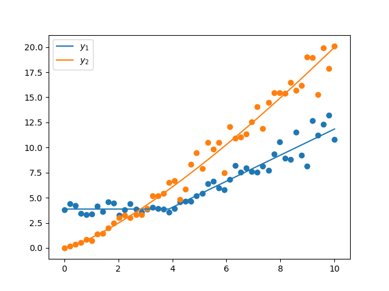

Example: Piecewise model using CallableNumericalModel
=====================================================

Below is an example of how to use the
:class:`symfit.core.models.CallableNumericalModel`. This class allows you to
provide custom callables as your model, while still allowing clean interfacing
with the :mod:`symfit` API.

These models also accept a mixture of symbolic and callable components, as will
be demonstrated below. This allows the power-user great flexibility, since it is
still easy to interface with :mod:`symfit`'s constraints, minimizers, etc.

.. literalinclude:: ../../examples/callable_numerical_model.py
    :language: python

This is the resulting fit:

