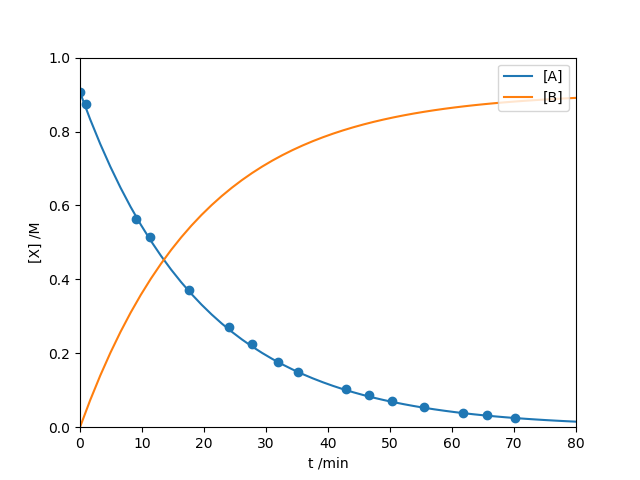

Example: ODEModel for Reaction Kinetics
=======================================

Below is an example of how to use the :class:`symfit.core.models.ODEModel`. In
this example we will fit reaction kinetics data, taken from libretexts_.

The data is from a first-order reaction :math:`\text{A} \rightarrow \text{B}`.

.. literalinclude:: ../../examples/ode_reaction_kinetics_simple.py
    :language: python

This is the resulting fit:

.. _libretexts: http://chem.libretexts.org/Core/Physical_Chemistry/Kinetics/Rate_Laws/The_Rate_Law