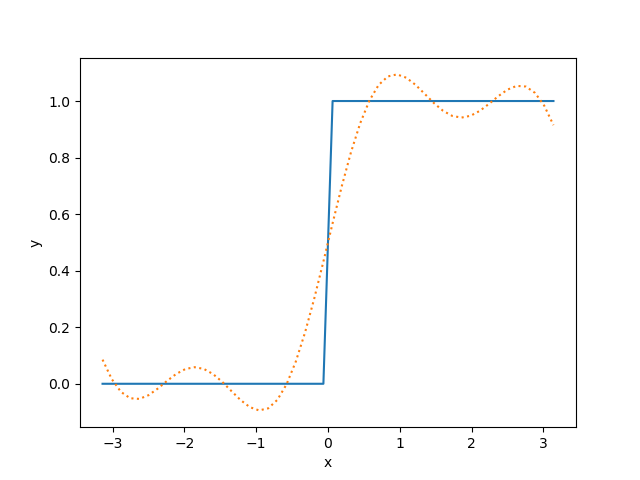

Example: Fourier Series
=======================

Suppose we want to fit a Fourier series to a dataset. As an example, let's take
a step function:

.. math:: f(x) = \begin{cases} 0 & \text{if}\quad - \pi < x \leq 0 \\
                               1 & \text{if}\quad     0 < x < \pi
                 \end{cases}

In the example below, we will attempt to fit this with a Fourier Series of order
:math:`n=3`.

.. math:: y(x) = a_0 + \sum_{i=1}^n a_i cos(i \omega x)
                 + \sum_{i=1}^n b_i sin(i \omega x)

.. literalinclude:: ../../examples/fourier_series.py
    :language: python

This code prints::

    {y: a0 + a1*cos(w*x) + a2*cos(2*w*x) + a3*cos(3*w*x) + b1*sin(w*x) + b2*sin(2*w*x) + b3*sin(3*w*x)}

    Parameter Value        Standard Deviation
    a0        5.000000e-01 2.075395e-02
    a1        -4.903805e-12 3.277426e-02
    a2        5.325068e-12 3.197889e-02
    a3        -4.857033e-12 3.080979e-02
    b1        6.267589e-01 2.546980e-02
    b2        1.986491e-02 2.637273e-02
    b3        1.846406e-01 2.725019e-02
    w         8.671471e-01 3.132108e-02
    Fitting status message: Optimization terminated successfully.
    Number of iterations:   44
    Regression Coefficient: 0.9401712713086535

