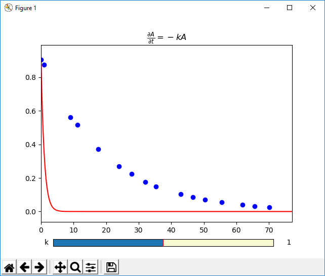

Example: Interactive Guesses ODE
================================

Below is an example in which the initial guesses module
is used to help solve an ODE problem.

.. literalinclude:: ../../symfit/contrib/interactive_guess/examples/ODE_example.py
    :language: python

This is a screenshot of the interactive guess window:

By using the sliders, you can interactively play with the initial guesses until
it is close enough. Then after closing the window, this initial value is set
for the parameter, and the fit can be performed.