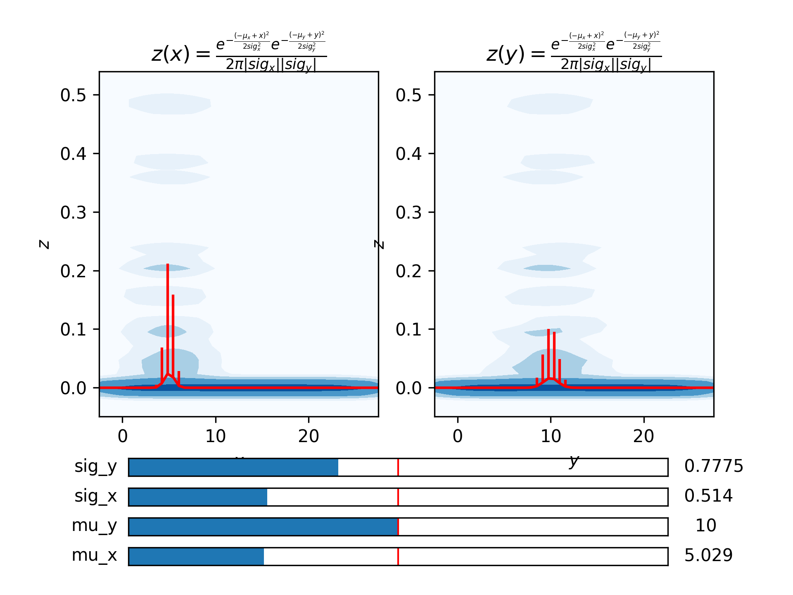

Example: Interactive Guesses in N dimensions
============================================

Below is an example in which the initial guesses module
is used to help fit a function that depends on more than one independent
variable:

.. literalinclude:: ../../symfit/contrib/interactive_guess/examples/simple_3D_example.py
    :language: python

This is a screenshot of the interactive guess window:

In the window you can see the range the provided data spans as a contourplot on
the background. The evaluated models is shown as red lines. By default your
proposed model is evaluated at :math:`50^n` points for :math:`n` independent
variables, with 50 points per dimension. So in the example this is at 50 values
of ``x`` and 50 values of ``y``. The error bars on the points plotted are taken
from the spread in ``z`` that comes from the spread in data in the
other dimensions (``y`` and ``x`` respectively). The error bars correspond (by
default) to the 90% percentile.

By using the sliders, you can interactively play with the initial guesses until
it is close enough. Then after closing the window, this initial values are set
for the parameters, and the fit can be performed.
