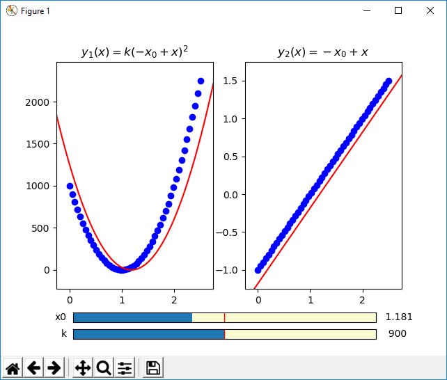

Example: Interactive Guesses Vector Model
=========================================

Below is an example in which the initial guesses module
is used to help solve two-component vector valued function:

.. literalinclude:: ../../symfit/contrib/interactive_guess/examples/vector_valued_2D.py
    :language: python

This is a screenshot of the interactive guess window:

By using the sliders, you can interactively play with the initial guesses until
it is close enough. Then after closing the window, this initial values are set
for the parameters, and the fit can be performed.