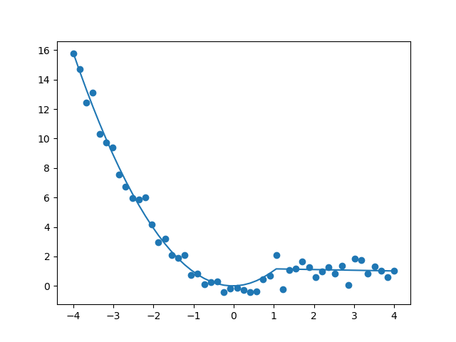
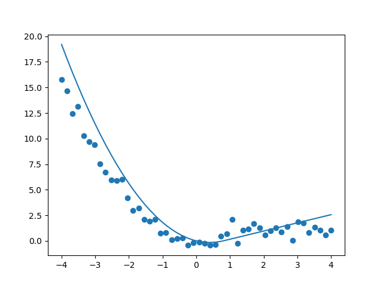

Example: Piecewise continuous function
======================================

Piecewise continuus functions can be tricky to fit. However, using the
:mod:`symfit` interface this process is made a lot easier. Suppose we want to
fit to the following model:

.. math:: f(x) = \begin{cases} x^2 - a x & \text{if}\quad x \leq x_0 \\
                               a x + b   & \text{otherwise}
                 \end{cases}

The script below gives an example of how to fit such a model:

.. literalinclude:: ../../examples/piecewise2.py
    :language: python

This code prints::

    Parameter Value        Standard Deviation
    a         -4.780338e-02 None
    b         1.205443e+00 None
    x0        1.051163e+00 None
    Fitting status message: Optimization terminated successfully.
    Number of iterations:   18
    Regression Coefficient: 0.9849188499599985

Judging from this graph, another possible solution would have been to also
demand a continuous derivative at the point `x0`. This can be achieved by
setting the following constraints instead::

    constraints = [
        Eq(y1.diff(x).subs({x: x0}), y2.diff(x).subs({x: x0})),
        Eq(y1.subs({x: x0}), y2.subs({x: x0}))
    ]

This gives the following plot:

and the following fit report::

    Parameter Value        Standard Deviation
    a         8.000000e-01 None
    b         -6.400000e-01 None
    x0        8.000000e-01 None
    Fitting status message: Optimization terminated successfully.
    Number of iterations:   3
    Regression Coefficient: 0.8558226069368662

The first fit is therefore the prevered one, but it does show you how easy it is
to set these constraints using :mod:`symfit`.