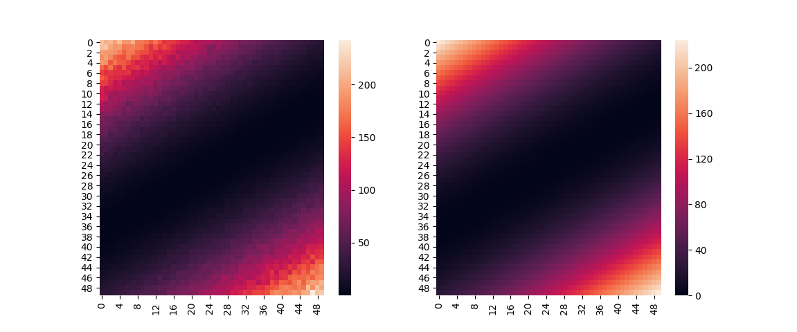

Example: Polynomial Surface Fit
===============================

In this example, we want to fit a polynomial to a 2D surface. Suppose the
surface is described by

.. math:: f(x) = x^2 + y^2 + 2 x y

A fit to such data can be performed as follows:

.. literalinclude:: ../../examples/poly_surface_fit.py
    :language: python

This code prints::

    z(x, y; c1, c2) = c1*x**2 + c1*y**2 + c2*x*y

    Parameter Value        Standard Deviation
    c1        9.973489e-01 1.203071e-03
    c2        1.996901e+00 3.736484e-03
    Fitting status message: Optimization terminated successfully.
    Number of iterations:   6
    Regression Coefficient: 0.9952824293713467

