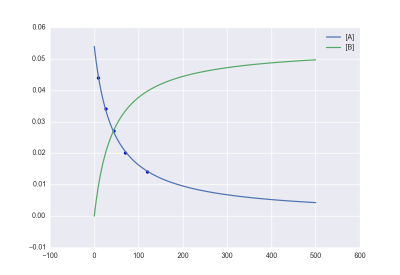
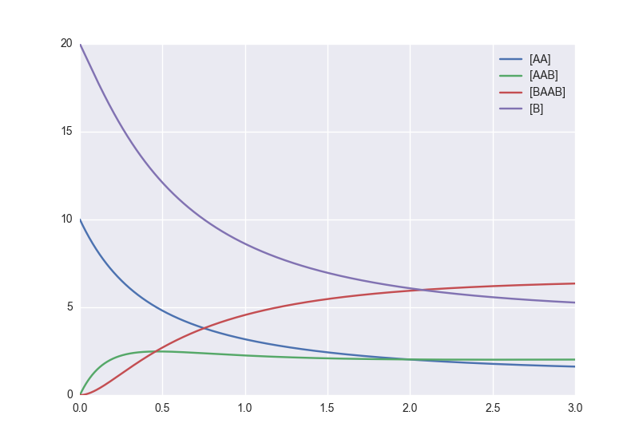
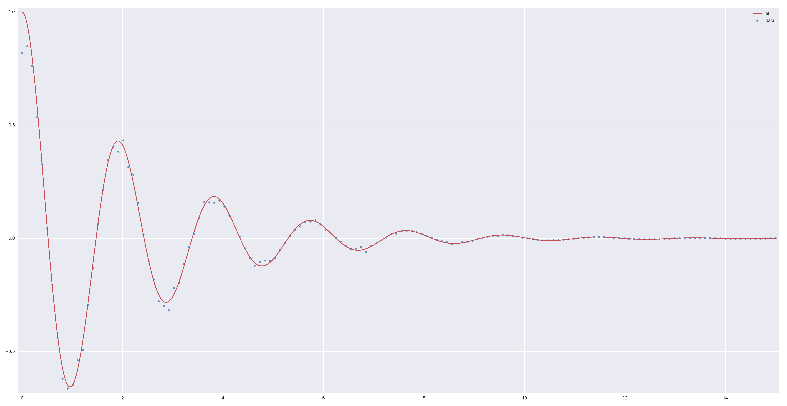
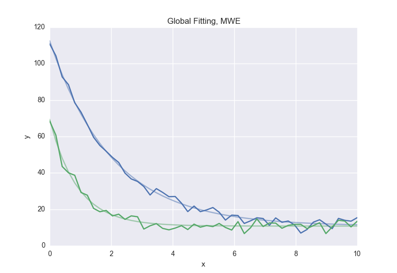

Fitting Types
=============

Fit (Least Squares)
-------------------
The default fitting object does least-squares fitting::

    from symfit import parameters, variables, Fit
    import numpy as np

    # Define a model to fit to.
    a, b = parameters('a, b')
    x = variables('x')
    model = a * x + b

    # Generate some data
    xdata = np.linspace(0, 100, 100)  # From 0 to 100 in 100 steps
    a_vec = np.random.normal(15.0, scale=2.0, size=(100,))
    b_vec = np.random.normal(100.0, scale=2.0, size=(100,))
    # Point scattered around the line 5 * x + 105
    ydata = a_vec * xdata + b_vec

    fit = Fit(model, xdata, ydata)
    fit_result = fit.execute()

.. figure:: _static/linear_model_fit.png
   :width: 300px
   :alt: Linear Model Fit Data

The :class:`~symfit.core.fit.Fit` object also supports standard deviations. In
order to provide these, it's nicer to use a named model::

    a, b = parameters('a, b')
    x, y = variables('x, y')
    model = {y: a * x + b}

    fit = Fit(model, x=xdata, y=ydata, sigma_y=sigma)

.. warning:: :mod:`symfit` assumes these sigma to be from measurement errors by
  default, and not just as a relative weight. This means the standard
  deviations on parameters are calculated assuming the absolute size of sigma
  is significant. This is the case for measurement errors and therefore for
  most use cases :mod:`symfit` was designed for. If you only want to use the
  sigma for relative weights, then you can use ``absolute_sigma=False`` as a
  keyword argument.

  Please note that this is the opposite of the convention used by scipy's
  :func:`~scipy.optimize.curve_fit`. Looking through their mailing list this
  seems to have been implemented the opposite way for historical reasons, and
  was understandably never changed so as not to loose backwards compatibility.
  Since this is a new project, we don't have that problem.

.. _constrained-leastsq:

Constrained Least Squares Fit
-----------------------------
The :class:`~symfit.core.fit.Fit` takes a ``constraints`` keyword; a list of
relationships between the parameters that has to be respected. As an example of
fitting with constraints, we could imagine fitting the angles of a triangle::

  a, b, c = parameters('a, b, c')
  a_i, b_i, c_i = variables('a_i, b_i, c_i')

  model = {a_i: a, b_i: b, c_i: c}

  data = np.array([
      [10.1, 9., 10.5, 11.2, 9.5, 9.6, 10.],
      [102.1, 101., 100.4, 100.8, 99.2, 100., 100.8],
      [71.6, 73.2, 69.5, 70.2, 70.8, 70.6, 70.1],
  ])

  fit = Fit(
      model=model,
      a_i=data[0],
      b_i=data[1],
      c_i=data[2],
      constraints=[Equality(a + b + c, 180)]
  )
  fit_result = fit.execute()

The line ``constraints=[Equality(a + b + c, 180)]`` ensures the our basic
knowledge of geometry is respected despite my sloppy measurements.

.. note:: Under the hood, a different `Minimizer` is used to perform a
  constrained fit. :class:`~symfit.core.fit.Fit` tries to select the
  right `Minimizer` based on the problem you present it with.
  See :class:`~symfit.core.fit.Fit` for more.

(Non)LinearLeastSquares
-----------------------
The :class:`~symfit.core.fit.LinearLeastSquares` implements the analytical
solution to Least Squares fitting. When your model is linear in it's parameters,
consider using this rather than the default
:class:`~symfit.core.fit.Fit` since this gives the exact
solution in one step, no iteration and no guesses needed.

:class:`~symfit.core.fit.NonLinearLeastSquares` is the generalization to
non-linear models. It works by approximating the model by a linear one around
the value of your guesses and repeating that process iteratively. This process
is therefore very sensitive to getting good initial guesses.

Notes on these objects:

- Use :class:`~symfit.core.fit.NonLinearLeastSquares` instead of
  :class:`~symfit.core.fit.LinearLeastSquares` unless you have a reason not to.
  :class:`~symfit.core.fit.NonLinearLeastSquares` will behave exactly the same
  as :class:`~symfit.core.fit.LinearLeastSquares` when the model is linear.
- Bounds are currently ignored by both. This is because for linear models there
  can only be one solution.
  For non-linear models it simply hasn't been considered yet.
- When performance matters, use :class:`~symfit.core.fit.Fit`
  instead of :class:`~symfit.core.fit.NonLinearLeastSquares`.
  These analytical objects are implemented in pure python and are therefore
  massively outgunned by :class:`~symfit.core.fit.Fit` which is ultimately a
  wrapper to efficient numerical methods such as MINPACK of BFGS implemented in
  Fortran.

Likelihood
----------
Given a dataset and a model, what values should the model's parameters have to
make the observed data most likely? This is the principle of maximum likelihood
and the question the Likelihood object can answer for you.

Example::

    from symfit import Parameter, Variable, exp
    from symfit.core.objectives import LogLikelihood
    import numpy as np

    # Define the model for an exponential distribution (numpy style)
    beta = Parameter()
    x = Variable()
    model = (1 / beta) * exp(-x / beta)

    # Draw 100 samples from an exponential distribution with beta=5.5
    data = np.random.exponential(5.5, 100)

    # Do the fitting!
    fit = Fit(model, data, objective=LogLikelihood)
    fit_result = fit.execute()

``fit_result`` is a normal :class:`~symfit.core.fit_results.FitResults` object.
As always, bounds on parameters and even constraints are supported.

Minimize/Maximize
-----------------
Minimize or Maximize a model subject to bounds and/or constraints. As an example
I present an example from the
`scipy docs <https://docs.scipy.org/doc/scipy/reference/tutorial/optimize.html>`_.

Suppose we want to maximize the following function:

.. math::

  f(x,y) = 2xy + 2x - x^2 - 2y^2

Subject to the following constraints:

.. math:: 

  x^3 - y = 0
.. math::

  y - 1 >= 0 

In SciPy code the following lines are needed::

    def func(x, sign=1.0):
        """ Objective function """
        return sign*(2*x[0]*x[1] + 2*x[0] - x[0]**2 - 2*x[1]**2)

    def func_deriv(x, sign=1.0):
        """ Derivative of objective function """
        dfdx0 = sign*(-2*x[0] + 2*x[1] + 2)
        dfdx1 = sign*(2*x[0] - 4*x[1])
        return np.array([ dfdx0, dfdx1 ])

    cons = ({'type': 'eq',
            'fun' : lambda x: np.array([x[0]**3 - x[1]]),
            'jac' : lambda x: np.array([3.0*(x[0]**2.0), -1.0])},
            {'type': 'ineq',
            'fun' : lambda x: np.array([x[1] - 1]),
            'jac' : lambda x: np.array([0.0, 1.0])})

    res = minimize(func, [-1.0,1.0], args=(-1.0,), jac=func_deriv,
                   constraints=cons, method='SLSQP', options={'disp': True})

Takes a couple of read-throughs to make sense, doesn't it? Let's do the same
problem in :mod:`symfit`::

    from symfit import parameters, Maximize, Eq, Ge

    x, y = parameters('x, y')
    model = 2*x*y + 2*x - x**2 -2*y**2
    constraints = [
        Eq(x**3 - y, 0),
        Ge(y - 1, 0),
    ]

    fit = Fit(- model, constraints=constraints)
    fit_result = fit.execute()

Done! :mod:`symfit` will determine all derivatives automatically, no need for
you to think about it. Notice the minus sign in the call to `Fit`. This is
because `Fit` will always minimize, so in order to achieve maximization we should
minimize `- model`.

.. warning:: You might have noticed that ``x`` and ``y`` are
  :class:`~symfit.core.argument.Parameter`'s in the above problem, which may
  strike you as weird. However, it makes perfect sense because in this problem
  they are parameters to be optimised, not independent variables. Furthermore,
  this way of defining it is consistent with the treatment of
  :class:`~symfit.core.argument.Variable`'s and
  :class:`~symfit.core.argument.Parameter`'s in :mod:`symfit`. Be aware of this
  when minimizing such problems, as the whole process won't work otherwise.

ODE Fitting
-----------
Fitting to a system of ordinary differential equations (ODEs) is also
remarkedly simple with :mod:`symfit`. Let's do a simple example from reaction
kinetics. Suppose we have a reaction A + A -> B with rate constant :math:`k`.
We then need the following system of rate equations:

.. math::

  \frac{dA}{dt} = -k A^2

  \frac{dB}{dt} = k A^2

In :mod:`symfit`, this becomes::

    model_dict = {
        D(a, t): - k * a**2,
        D(b, t): k * a**2,
    }

We see that the :mod:`symfit` code is already very readable. Let's do a fit to
this::

    tdata = np.array([10, 26, 44, 70, 120])
    adata = 10e-4 * np.array([44, 34, 27, 20, 14])
    a, b, t = variables('a, b, t')
    k = Parameter(0.1)
    a0 = 54 * 10e-4

    model_dict = {
        D(a, t): - k * a**2,
        D(b, t): k * a**2,
    }

    ode_model = ODEModel(model_dict, initial={t: 0.0, a: a0, b: 0.0})

    fit = Fit(ode_model, t=tdata, a=adata, b=None)
    fit_result = fit.execute()

That's it! An :class:`~symfit.core.fit.ODEModel` behaves just like any other
model object, so :class:`~symfit.core.fit.Fit` knows how to deal with it! Note
that since we don't know the concentration of B, we explicitly set ``b=None``
when calling :class:`~symfit.core.fit.Fit` so it will be ignored.

.. warning:: Fitting to ODEs is extremely difficult from an algorithmic point
  of view, since these systems are usually very sensitive to the parameters.
  Using (very) good initial guesses for the parameters and initial values is
  critical.

Upon every iteration of performing the fit the ODEModel is integrated again from
the initial point using the new guesses for the parameters.

We can plot it just like always::

    # Generate some data
    tvec = np.linspace(0, 500, 1000)

    A, B = ode_model(t=tvec, **fit_result.params)
    plt.plot(tvec, A, label='[A]')
    plt.plot(tvec, B, label='[B]')
    plt.scatter(tdata, adata)
    plt.legend()
    plt.show()

As an example of the power of :mod:`symfit`'s ODE syntax, let's have a look at
a system with 2 equilibria: compound AA + B <-> AAB and AAB + B <-> BAAB.

In :mod:`symfit` these can be implemented as::

    AA, B, AAB, BAAB, t = variables('AA, B, AAB, BAAB, t')
    k, p, l, m = parameters('k, p, l, m')

    AA_0 = 10  # Some made up initial amound of [AA]
    B = AA_0 - BAAB + AA  # [B] is not independent.

    model_dict = {
        D(BAAB, t): l * AAB * B - m * BAAB,
        D(AAB, t): k * A * B - p * AAB - l * AAB * B + m * BAAB,
        D(A, t): - k * A * B + p * AAB,
    }

The result is as readable as one can reasonably expect from a multicomponent
system (and while using chemical notation).
Let's plot the model for some kinetics constants::

    model = ODEModel(model_dict, initial={t: 0.0, AA: AA_0, AAB: 0.0, BAAB: 0.0})

    # Generate some data
    tdata = np.linspace(0, 3, 1000)
    # Eval the normal way.
    AA, AAB, BAAB = model(t=tdata, k=0.1, l=0.2, m=0.3, p=0.3)

    plt.plot(tdata, AA, color='red', label='[AA]')
    plt.plot(tdata, AAB, color='blue', label='[AAB]')
    plt.plot(tdata, BAAB, color='green', label='[BAAB]')
    plt.plot(tdata, B(BAAB=BAAB, AA=AA), color='pink', label='[B]')
    # plt.plot(tdata, AA + AAB + BAAB, color='black', label='total')
    plt.legend()
    plt.show()

More common examples, such as dampened harmonic oscillators also work as expected::

    # Oscillator strength
    k = Parameter()
    # Mass, just there for the physics
    m = 1
    # Dampening factor
    gamma = Parameter()

    x, v, t = symfit.variables('x, v, t')

    # Define the force based on Hooke's law, and dampening
    a = (-k * x - gamma * v)/m
    model_dict = {
        D(x, t): v,
        D(v, t): a,
    }
    ode_model = ODEModel(model_dict, initial={t: 0, v: 0, x: 1})
    
    # Let's create some data...
    times = np.linspace(0, 15, 150)
    data = ode_model(times, k=11, gamma=0.9, m=m.value).x
    # ... and add some noise to it.
    noise = np.random.normal(1, 0.1, data.shape)  # 10% error
    data *= noise
    
    fit = Fit(ode_model, t=times, x=data)
    fit_result = fit.execute()

.. note:: Evaluating the model above will produce a named tuple with values for
  both ``x`` and ``v``. Since we are only interested in the values for ``x``,
  we immediately select it with ``.x``.

.. _global-fitting:

Global Fitting
--------------
In a global fitting problem, we fit to multiple datasets where one or more
parameters might be shared. The same syntax used for ODE fitting makes this
problem very easy to solve in :mod:`symfit`.

As a simple example, suppose we have two datasets measuring exponential decay,
with the same background, but different amplitude and decay rate.

.. math::

    f(x) = y_0 + a * e^{- b * x}

In order to fit to this, we define the following model::

    x_1, x_2, y_1, y_2 = variables('x_1, x_2, y_1, y_2')
    y0, a_1, a_2, b_1, b_2 = parameters('y0, a_1, a_2, b_1, b_2')

    model = Model({
        y_1: y0 + a_1 * exp(- b_1 * x_1),
        y_2: y0 + a_2 * exp(- b_2 * x_2),
    })

Note that ``y0`` is shared between the components. Fitting is then done in the
normal way::

    fit = Fit(model, x_1=xdata1, x_2=xdata2, y_1=ydata1, y_2=ydata2)
    fit_result = fit.execute()

.. warning::
  The regression coefficient is not properly defined for vector-valued models,
  but it is still listed!
  Until this is fixed, please recalculate it on your own for every component
  using the bestfit parameters.

  Do not cite the overall :math:`R^2` given by :mod:`symfit`.

Advanced usage
..............
In general, the separate components of the model can be whatever you need them
to be. You can mix and match which variables and parameters should be coupled
and decoupled ad lib. Some examples are given below.

Same parameters and same function, different (in)dependent variables::

    datasets = [data_1, data_2, data_3, data_4, data_5, data_6]

    xs = variables('x_1, x_2, x_3, x_4, x_5, x_6')
    ys = variables('y_1, y_2, y_3, y_4, y_5, y_6')
    zs = variables(', '.join('z_{}'.format(i) for i in range(1, 7)))
    a, b = parameters('a, b')

    model_dict = {
        z: a/(y * b) *  exp(- a * x)
            for x, y, z in zip(xs, ys, zs)
    }

What if the model is unnamed?
-----------------------------

Then you'll have to use the ordering. Variables throughout :mod:`symfit`'s
objects are internally ordered in the following way: first independent
variables, then dependent variables, then sigma variables, and lastly
parameters when applicable. Within each group alphabetical ordering applies.

It is therefore always possible to assign data to variables in an unambiguous
way using this ordering. For example::

    fit = Fit(model, x_data, y_data, sigma_y_data)

