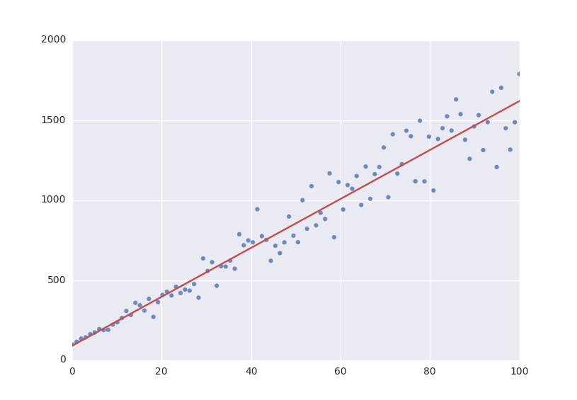

Tutorial
========

Simple Example
--------------
The example below shows how easy it is to define a model that we could fit to.

::

  from symfit import Parameter, Variable
  
  a = Parameter('a')
  b = Parameter('b')
  x = Variable('x')
  model = a * x + b

Lets fit this model to some generated data. ::

  from symfit import Fit
  import numpy as np
  
  xdata = np.linspace(0, 100, 100) # From 0 to 100 in 100 steps
  a_vec = np.random.normal(15.0, scale=2.0, size=(100,))
  b_vec = np.random.normal(100.0, scale=2.0, size=(100,))
  ydata = a_vec * xdata + b_vec  # Point scattered around the line 5 * x + 105
  
  fit = Fit(model, xdata, ydata)
  fit_result = fit.execute()

.. figure:: _static/linear_model_fit_data.png
   :width: 300px
   :alt: Linear Model Fit Data

Printing ``fit_result`` will give a full report on the values for every
parameter, including the uncertainty, and quality of the fit.

Initial Guess
-------------
For fitting to work as desired you should always give a good initial guess for
a parameter. The :class:`~symfit.core.argument.Parameter` object can therefore
be initiated with the following keywords:

* ``value`` the initial guess value. Defaults to ``1``.
* ``min`` Minimal value for the parameter.
* ``max`` Maximal value for the parameter.
* ``fixed`` Whether the parameter's ``value`` can vary during fitting.

In the example above, we might change our
:class:`~symfit.core.argument.Parameter`'s to the following after looking at a
plot of the data::

  k = Parameter('k', value=4, min=3, max=6)

  a, b = parameters('a, b')
  a.value = 60
  a.fixed = True

Accessing the Results
---------------------
A call to :meth:`Fit.execute <symfit.core.fit.Fit.execute>` returns a
:class:`~symfit.core.fit_results.FitResults` instance. This object holds all information
about the fit. The fitting process does not modify the
:class:`~symfit.core.argument.Parameter` objects. In the above example,
``a.value`` will still be ``60`` and not the value we obtain after fitting. To
get the value of fit parameters we can do::

  >>> print(fit_result.value(a))
  >>> 14.66946...
  >>> print(fit_result.stdev(a))
  >>> 0.3367571...
  >>> print(fit_result.value(b))
  >>> 104.6558...
  >>> print(fit_result.stdev(b))
  >>> 19.49172...
  >>> print(fit_result.r_squared)
  >>> 0.950890866472

For more :class:`~symfit.core.fit_results.FitResults`, see the :ref:`apidocs`.

Evaluating the Model
--------------------
With these parameters, we could now evaluate the model with these parameters so
we can make a plot of it. In order to do this, we simply call the model with
these values::

  import matplotlib.pyplot as plt
  
  y = model(x=xdata, a=fit_result.value(a), b=fit_result.value(b))
  plt.plot(xdata, y)
  plt.show()

  
The model *has* to be called by keyword arguments to prevent any ambiguity. So
the following does not work::

  y = model(xdata, fit_result.value(a), fit_result.value(b))
  
To make life easier, there is a nice shorthand notation to immediately use a
fit result::

  y = model(x=xdata, **fit_result.params)
  
This immediately unpacks an :class:`~collections.OrderedDict` containing the optimized fit
parameters.

Named Models
------------

More complicated models are also relatively easy to deal with by using named
models. Let's try our luck with a bivariate normal distribution::

  from symfit import parameters, variables, exp, pi, sqrt

  x, y, p = variables('x, y, p')
  mu_x, mu_y, sig_x, sig_y, rho = parameters('mu_x, mu_y, sig_x, sig_y, rho')

  z = (
      (x - mu_x)**2/sig_x**2
      + (y - mu_y)**2/sig_y**2
      - 2 * rho * (x - mu_x) * (y - mu_y)/(sig_x * sig_y)
  )
  model = {
      p: exp(
          - z / (2 * (1 - rho**2)))
          / (2 * pi * sig_x * sig_y * sqrt(1 - rho**2)
      )
  }

  fit = Fit(model, x=xdata, y=ydata, p=pdata)

By using the magic of named models, the flow of information is still relatively
clear, even with such a complicated function.

This syntax also supports vector valued functions::

    model = {y_1: a * x**2, y_2: 2 * x * b}

One thing to note about such models is that now ``model(x=xdata)`` obviously no
longer works as ``type(model) == dict``. There is a preferred way to resolve
this. If any kind of fitting object has been initiated, it will have a
`.model` atribute containing an instance of
:class:`~symfit.core.models.Model`. This can again be called::

    a, b = parameters('a, b')
    y_1, y_2, x = variables('y_1, y_2, x')
    
    model = {y_1: a * x**2, y_2: 2 * x * b}
    fit = Fit(model, x=xdata, y_1=y_data1, y_2=y_data2)
    fit_result = fit.execute()

    y_1_result, y_2_result = fit.model(x=xdata, **fit_result.params)

This returns a :func:`~collections.namedtuple`, with the components evaluated.
So through the magic of tuple unpacking, ``y_1`` and ``y_2`` contain the
evaluated fit. The dependent variables will be ordered alphabetically in the
returned :func:`~collections.namedtuple`. Alternatively, the unpacking can be
performed explicitly.

If for some reason no :class:`~symfit.core.fit.Fit` is initiated you can make a
:class:`~symfit.core.models.Model` object yourself::

    model = Model(model_dict)
    y_1_result, y_2_result = model(x=xdata, a=2.4, b=0.1)

or equivalently::

    outcome = model(x=xdata, a=2.4, b=0.1)
    y_1_result = outcome.y_1
    y_2_result = outcome.y_2

symfit exposes sympy.api
------------------------

:mod:`symfit` exposes the `sympy <http://docs.sympy.org/latest/>`_ api as well,
so mathematical expressions such as :class:`~sympy.functions.elementary.exponential.exp`,
:class:`~sympy.functions.elementary.trigonometric.sin` and :class:`~sympy.core.numbers.Pi`
are importable from :mod:`symfit` as well. For more, read the
`sympy docs <http://docs.sympy.org>`_.
